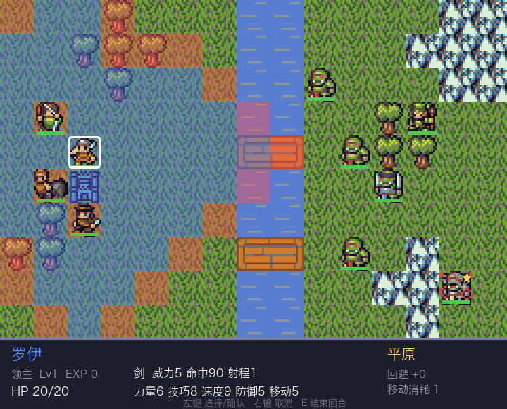
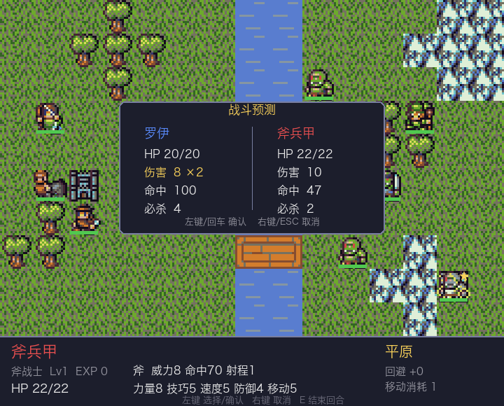
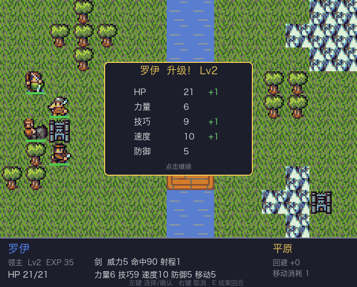

# 火焰纹章 · 单关战棋演示

用 Python + pygame 实现的火焰纹章（GBA 风格）回合制战棋：15×10 手工地图，我方 4 人
对敌方 6 人（含 Boss），完整实现武器克制三角、地形效果与经验升级。

| 移动与攻击范围 | 战斗预测 | 升级结算 |
|---|---|---|
|  |  |  |

## 安装与启动

```bash
python3 -m venv .venv
.venv/bin/pip install -r requirements.txt
.venv/bin/python tools/fetch_assets.py   # 下载 DawnLike 素材（约 1MB，仅需一次）
.venv/bin/python main.py
```

## 操作

| 输入 | 作用 |
|------|------|
| 左键 | 选择单位 / 确认移动 / 选择目标 / 确认攻击 |
| 右键 / ESC | 取消，逐级退回上一步 |
| E | 提前结束我方回合 |
| R | 结局画面后重新开始 |
| 鼠标悬停 | 底部信息栏查看单位属性与地形效果 |

**胜利条件**：歼灭全部敌人　**失败条件**：主角罗伊阵亡或我方全灭

## 规则速查

- **武器三角**：剑 ▶ 斧 ▶ 枪 ▶ 剑（克制方 +1 伤害 +15 命中，被克反之）；弓与魔法不参与
- **射程**：近战 1 格；弓只能打 2 格（贴脸打不到，但也不被近战反击）；魔法 1–2 格
- **追击**：速度比对方高 4 点及以上时攻击两次
- **必杀**：必杀率 = 武器必杀 + 技巧/2，造成 3 倍伤害
- **地形**：森林 +20 回避（移动消耗 2）；山地 +30 回避（消耗 3，骑兵不可入）；
  要塞 +20 回避且每回合恢复 20% HP；水域不可通行，过河走桥
- **经验**：命中 +10、击杀 +30、击杀 Boss +60；满 100 升级，属性按职业成长率随机提升

## 我方阵容

| 单位 | 职业 | 武器 | 定位 |
|------|------|------|------|
| 罗伊 | 领主 | 剑 | 均衡主力，不能阵亡 |
| 兰斯 | 重骑士 | 枪 | 移动 7 的先锋，注意山地不可入 |
| 丽贝卡 | 弓兵 | 弓 | 2 格狙击，无惧近战反击 |
| 莉莉娜 | 魔道士 | 魔法 | 高伤脆皮，1–2 格灵活输出 |

## 开发

```bash
.venv/bin/python -m pytest tests/ -v   # 30 个纯逻辑单元测试
.venv/bin/python assets.py             # 生成精灵映射预览图
```

代码结构：`settings/unit/combat/grid/ai` 为零 pygame 依赖的纯逻辑层（pytest 覆盖），
`assets/ui/game/main` 为渲染交互层。设计文档见 `docs/superpowers/specs/`。

## 素材与许可

美术素材使用 [DawnLike v1.81](https://opengameart.org/content/dawnlike-16x16-universal-rogue-like-tileset-v181)
（作者 DragonDePlatino，调色板 DawnBringer，CC-BY 4.0），详见 `CREDITS.txt`。
