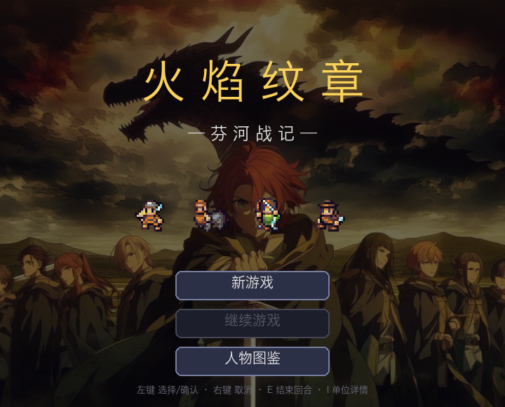
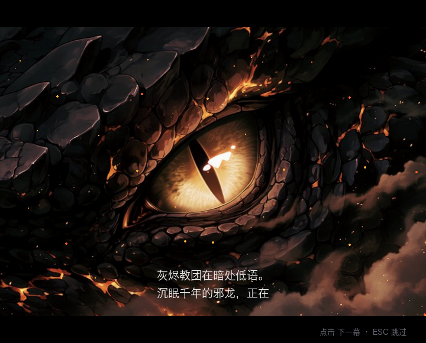
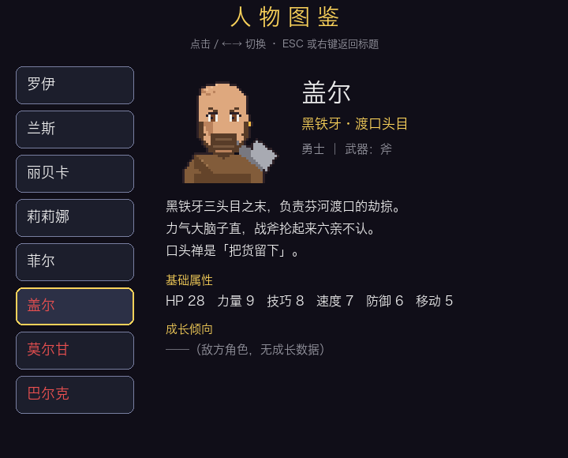
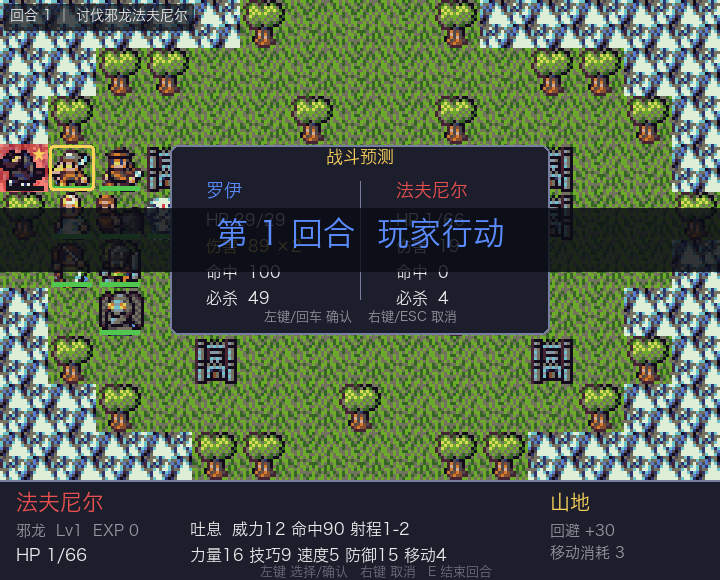
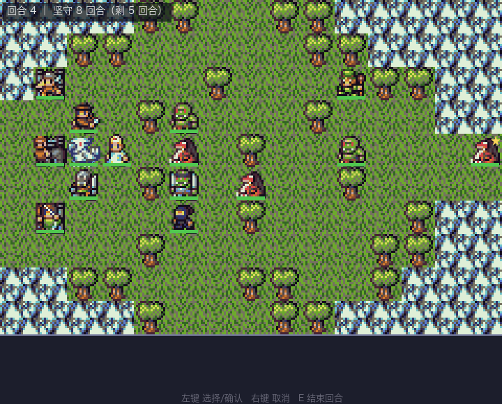
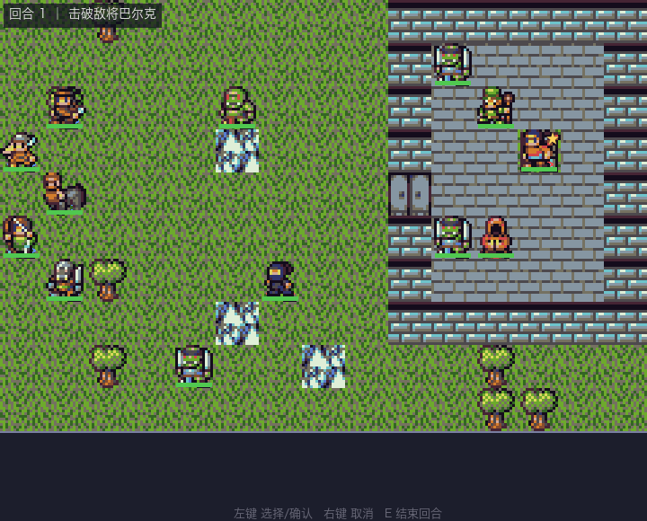

# 火焰纹章 · 芬河战记

用 Python + pygame 实现的火焰纹章（GBA 风格）回合制战棋——**三幕十章完整战役**：
黑铁牙盗贼团背后，灰烬教团正密谋唤醒千年邪龙。八人小队、AI 精绘立绘、
章节自动存档、火纹式剧情对话与 Boss 叫阵、人物图鉴（18人）、敌方增援、
占领/坚守等多种胜利条件，以及治疗牧师与飞行单位。
完整实现武器克制三角、地形效果、经验升级、伤药道具、守备 AI 与程序化 8-bit 音效。

| 标题键视觉 | 开场动画 | 人物图鉴(18人) |
|---|---|---|
|  |  |  |

| 终章·屠龙 | 山道防守战 | 要塞攻坚 |
|---|---|---|
|  |  |  |

## 安装与启动

```bash
python3 -m venv .venv
.venv/bin/pip install -r requirements.txt
.venv/bin/python tools/fetch_assets.py   # 下载 DawnLike 素材（约 1MB，仅需一次）
.venv/bin/python main.py
```

**打包独立 App**（macOS，免 Python 环境双击即玩）：

```bash
.venv/bin/pip install pyinstaller
./tools/build_app.sh        # 产出 dist/芬河战记.app
```

## 三幕十章战役

| 章 | 标题 | 看点 | 胜利条件 |
|----|------|------|---------|
| 一 | 渡河遭遇 | 双桥渡河，地形卡口 | 歼灭 |
| 二 | 林间伏击 | 森林伏兵，剑士菲尔加入 | 歼灭 |
| 三 | 黑铁要塞 | 攻城战，揭开教团阴谋 | 击破敌将 |
| 四 | 风雪驿道 | 修女西娅加入（治疗杖） | 歼灭 |
| 五 | 夺取河港 | 天马骑士艾莉丝加入，飞龙增援 | 罗伊占领城门 |
| 六 | 风暴山道 | 要塞防守战，三波增援 | 坚守 8 回合 |
| 七 | 王都疑云 | 重甲兵加斯加入，刺客巷战 | 击破假面刺客 |
| 八 | 溃堤之战 | 双桥强渡 + 背后海盗伏兵 | 歼灭 |
| 九 | 灰烬祭坛 | 柱廊大殿，背刺增援 | 击破大祭司 |
| 十 | 屠龙·终章 | 火山龙巢，讨伐邪龙 | 击破法夫尼尔 |

敌人随章节全面强化（精锐加成），Boss 拥有专属强化。

- 我方等级与经验**跨章节保留**；每章开始 HP 回满、伤药补满
- 休闲模式：非主角阵亡本章退场、下章回归；主角阵亡即败北
- 败北后按 **R** 重试本章（回滚到本章开局，之前章节的成长保留）

## 存档与剧情

- **章节自动存档**：每章布阵与通关时自动写档；通关后自动删档开启新周目
- **战斗中挂起存档**：点击空地 → 地图菜单 →「保存进度」，回合数、单位位置血量、
  增援进度、Boss 叫阵状态全部精确保存；标题「继续游戏」直接回到战局
- **战绩记忆**：通关周目数、累计击破、最佳通关回合永久记录，标题画面展示
- 存档损坏时「继续游戏」自动灰显，不会崩溃
- 存档位置：源码运行在项目目录；独立 App 在 `~/Library/Application Support/芬河战记/`
- **剧情**：新游戏从世界观旁白开篇；每章战斗前后在战场上播放角色对话；
  首次攻击 Boss 触发叫阵对话；通关后有尾声旁白（ESC 可跳过任何剧情）
- **人物图鉴**：标题菜单进入，收录我方八人与历章 Boss 共 18 人的生平、属性与成长倾向

## 操作

| 输入 | 作用 |
|------|------|
| 左键 | 选择单位 / 确认移动 / 选择目标 / 确认攻击 |
| 左键点敌人（待机时） | 显示/隐藏该敌人的威胁范围 |
| 左键点空地 | 地图菜单：**结束回合 / 保存进度**（战斗中随时存档） |
| 右键 / ESC | 取消，逐级退回上一步；剧情中 ESC 整段跳过 |
| Tab | 循环选择下一个未行动单位 |
| D | 开关全体敌人危险范围叠加（受威胁的我方头顶红色 ! ） |
| Z | **时光回溯**：撤销上一次行动（每战 10 次，败北画面也可用） |
| 空格（按住） | 战斗/敌方回合 3 倍速快进 |
| E | 结束我方回合（尚有未行动单位时需按两次确认） |
| I | 查看悬停/选中单位的详情页（属性 + 生平） |
| R | 败北后重试本章；通关画面返回标题 |
| 鼠标悬停 | 底部信息栏查看单位属性与地形效果 |

## 规则速查

- **武器三角**：剑 ▶ 斧 ▶ 枪 ▶ 剑（克制方 +1 伤害 +15 命中，被克反之）；弓与魔法不参与
- **射程**：近战 1 格；弓只能打 2 格（贴脸打不到，但也不被近战反击）；魔法 1–2 格
- **追击**：速度比对方高 4 点及以上时攻击两次
- **必杀**：必杀率 = 武器必杀 + 技巧/2，造成 3 倍伤害
- **地形**：森林 +20 回避（移动消耗 2）；山地 +30 回避（消耗 3，骑兵不可入）；
  要塞 +20 回避且每回合恢复 10% HP；城门 +10 回避；水域/城墙不可通行
- **伤药**：每人每章 3 瓶，行动菜单「用药」恢复 12 HP（消耗该回合行动）
- **经验**：命中 +10、击杀 +40、击杀 Boss +80；满 100 升级，属性按职业成长率随机提升
- **守备 AI**：部分敌人原地驻守，进入其攻击圈或被攻击后会被激活

## 我方阵容

| 单位 | 职业 | 武器 | 定位 |
|------|------|------|------|
| 罗伊 | 领主 | 剑 | 均衡主力，不能阵亡 |
| 兰斯 | 重骑士 | 枪 | 移动 7 的先锋，山地不可入 |
| 丽贝卡 | 弓兵 | 弓 | 2 格狙击，无惧近战反击 |
| 莉莉娜 | 魔道士 | 魔法 | 高伤脆皮，1–2 格灵活输出 |
| 菲尔 | 剑士 | 剑 | 第二章加入，高速高必杀 |
| 西娅 | 修女 | 杖 | 第四章加入，治疗 10+力量 |
| 艾莉丝 | 天马骑士 | 枪 | 第五章加入，飞行无视地形 |
| 加斯 | 重甲兵 | 枪 | 第七章加入，人形堡垒 |

**新机制**：治疗（修女对相邻友军，+15 经验）；飞行单位全地形消耗 1 但不吃地形回避；
占领图主角踩点即胜；防守图撑过指定回合；敌方增援按回合从地图边缘涌入（有横幅预警）。

**体验细节**：战斗预测带「致命!/危险!」击破提示；必杀触发白闪；单位阵亡淡出；
通关画面有全员后日谈；假面刺客雷文会在第九章卷土重来。

**电影化开场**：新游戏播放 Ken Burns 运镜的前情提要动画（黄金麦原→烈焰村庄→邪龙之眼
→黎明行军→标题键视觉），黑边字幕逐字浮现，可跳过。标题画面以键视觉为背景。

**章节氛围**：风雪驿道飘雪、迷雾森林落叶、灰烬祭坛飞灰、龙巢余烬上涌，
配合每章专属色调；章节过场以本章地图为暗化背景。

**时光回溯**（参考 Engage 龙之时水晶 / TBW 回退的行业标配设计，
调研报告见 `docs/research/`）：每战 10 次，Z 键或地图菜单触发，
精确回到上一次我方行动前——包括撤销整个敌方回合，败北瞬间也能反悔。

## 开发

```bash
.venv/bin/python -m pytest tests/ -v     # 66 个纯逻辑单元测试
.venv/bin/python assets.py               # 生成精灵映射预览图
.venv/bin/python sfx.py                  # 试听全部程序化音效
.venv/bin/python tools/balance_sim.py 40 # 平衡性模拟（贪心bot打全战役统计胜率）
```

平衡基准（贪心 bot、不重试，40 局）逐章胜率：75/93/64/89/100/75/100/93/86/50。
终章对 bot 最严酷属有意为之；真人玩家有战术与败北重试，实际体验更宽松。改数值后请重跑模拟。

代码结构：`settings/unit/combat/grid/ai/save/story/records/paths` 为零 pygame 依赖的纯逻辑层
（pytest 覆盖），`assets/ui/game/sfx/main` 为渲染交互层。十章地图与全部数值集中在
`settings.py`，剧情文案与角色生平集中在 `story.py`，改平衡、加关卡、改台词只需改数据。
设计文档见 `docs/superpowers/specs/`。

## 素材与许可

- 地图/单位像素美术：[DawnLike v1.81](https://opengameart.org/content/dawnlike-16x16-universal-rogue-like-tileset-v181)
  （作者 DragonDePlatino，调色板 DawnBringer，CC-BY 4.0），详见 `CREDITS.txt`
- 角色立绘：LibTV（Midjourney Niji 7）AI 生成（`assets/portraits/`）；
  另有 `tools/gen_portraits.py` 可重新生成原创像素风版本作为替代
- 音效：运行时 numpy 程序化合成，无外部音频文件
